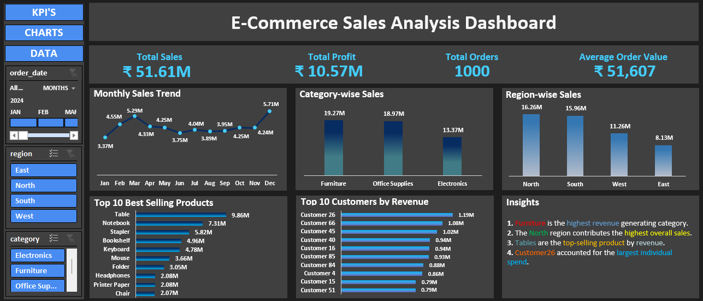

# E-Commerce-Sales-Analysis-SQL-Excel-Dashboard

## Description
This project analyses e-commerce sales data using SQL and Microsoft Excel to uncover revenue trends, profitability, customer behavior and product performance. SQL was used to extract key business insights, and Excel was used to build an interactive dashboard for visualization and reporting.

## Dashboard Preview

## Tools Used
- SQL (MySQL)
- Microsoft Excel
- Pivot Tables
- Pivot Charts
- Slicers
- Dashboard Design

## Objectives
- Analyze revenue and profit performance
- Identify top customers and best-selling products
- Compare sales across categories and regions
- Track monthly sales trends
- Build an interactive dashboard for business decision-making

## Business Questions Addressed
1. What is the total revenue and total profit?
2. How many orders were placed?
3. What is the average order value?
4. How do sales change over time?
5. Who are the top 10 customers by revenue?
6. What are the top 10 best-selling products?
7. Which product categories generate the most sales?
8. Which regions contribute the highest revenue?
9. How do products rank based on total sales?

## Key Insights
- Furniture is the highest revenue generating category(₹19.27M).
- The North region contributes the highest overall sales(₹16.26M).
- Tables are the top-selling product by revenue(₹9.86M).
- Customer26 accounted for the largest individual spend(₹1.19M).

## Conclusion and Recommendations
The analysis provides a comprehensive view of sales and profitability across customers, products, and regions. Businesses can use these insights to strengthen relationships with high-value customers, optimize product offerings, and focus marketing efforts on top-performing regions.

## Files Included
- E-Commerce_Dashboard.xlsx
- E-Commerce_sql_queries.docx
- dashboard.png
- README.md

## Download Project Files
- [Download Excel Dashboard](E-Commerce_Dashboard.xlsx)
- [Download SQL Queries](E-Commerce_sql_queries.docx)

  
